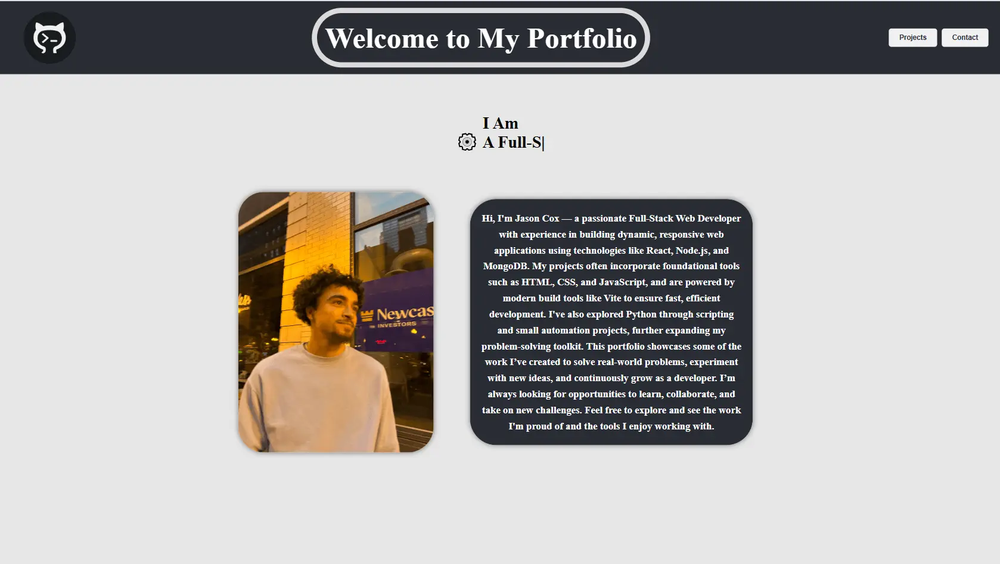
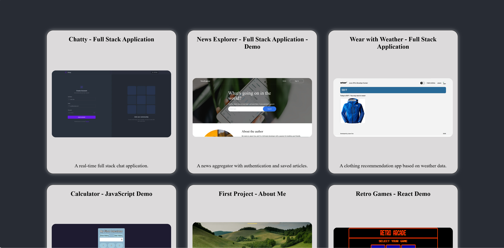

# Developer Portfolio Web App

A personal portfolio web application showcasing my projects, skills, and experience as a full-stack developer. Built with React, and modern web tools, it provides a clean interface for exploring my work and includes features like project details, a contact form, and smooth animations.

## 🚀 Features

- 📂 Interactive project gallery with GitHub integration
- ✨ Clean, responsive design optimized for all devices
- 📧 Contact form for inquiries
- 🖼️ Project details with live demo (if applicable) and source code links
- 🎨 Smooth animations and transitions for a polished experience

## 🛠️ Tech Stack

- React
- Tailwind CSS
- GitHub API (to fetch repositories dynamically)
- Deployed with Vercel

## 📸 Screenshots

_(Add screenshots or GIFs of the UI here)_



## ⚡ Getting Started

Clone the repository:

```bash
git clone https://github.com/TaxiDriver802/portfolio.git
cd portfolio

npm install
npm run dev


📬 Contact
If you’d like to get in touch, reach me at:
Email: JAcox12@icloud.com
Phone: 612-978-3896
LinkedIn: Your LinkedIn Profile
```
